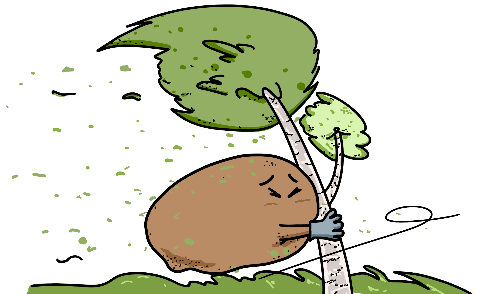

Het gebeurde op een basisschool. Van 08:00 tot wel 14:00. Toen het daar pauze was, was er een hele harde wind. Het was wel opeens en dat was eigenlijk heel raar. Gisteren was er bijna geen wind. Ik ben benieuwd, wat denken jullie lezers? Klimaatverandering? Of was het gewoon toeval? 

<!--truncate-->
              
### Zeldzaam
Nou, ik zeg altijd toeval bestaat niet. Misschien is het iets anders, gewoon niets ergs! Maar misschien ook niet, misschien is het iets heel ergs. In Eindhoven zijn er namelijk bijna geen tornado's, eentje is heel zeldzaam. Dit was nog vandaag gebeurd en het is heel erg. Het waaide namelijk heel erg hard vandaag om 08:20.

### Gevaarlijk
Het waaide heel erg hard vandaag. In Noord-Holland, Friesland, Flevoland en het IJsselmeergebied gold daarom lange tijd code rood. Dat betekent dat het buiten gevaarlijk kan zijn en dat er schade kan ontstaan. 

### De schade
In de provincie Noord-Holland kon je het beste binnenblijven. Er konden windstoten komen van 100 tot 140 kilometer per uur. In Haarlem is een vrouw van 51 overleden nadat er een boom op haar auto viel. Inmiddels is code rood weer ingetrokken. De storm is naar het zuidwesten van Friesland getrokken, en lijkt in kracht af te nemen.Het heeft de naam Poly gekregen. Door de wind braken bomen en takken af. Ook kantelden op sommige plekken vrachtwagens, bussen en caravans. De snelweg A9 was een tijd dicht, omdat er een boom op de weg was gevallen.

### Help bij een tornado
Ga schuilen in een gebouw. Blijf in kleine ruimtes, bijvoorbeeld een wc. Want er kunnen dingen tegen je aan worden gelanceerd. Bijvoorbeeld als er een klein hoopje zand heel hard tegen je aan komt doet dat best wel veel pijn. En blijf natuurlijk zo laag mogelijk in het gebouw.