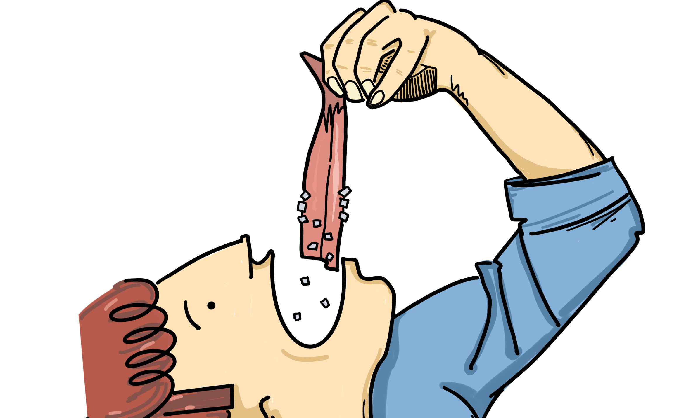

De nieuwe haring is heel lekker Tip: je moet eerst de haring zelf zonder uien proberen, dan proef je ook ECHT de smaak van de haring. Het lijkt een klein beetje op sashimi voor de mensen die niet weten wat sashimi is. Sashimi is iets rauw eten met saus of gewoon zonder.

<!--truncate-->

### Waar?
De winkel ligt in Waalre Aalst, de winkel heet [Zwarthoed Viswinkel](https://zwarthoedviswinkel.nl/). Hele aardige medewerkers, en het eten is overheerlijk! 

### Aanrader
Het eten is echt een aanradertje en vooral door het eten maar ook door de lieve mensen daar natuurlijk. De kibbeling is lekker krokant en niet te zoutig.