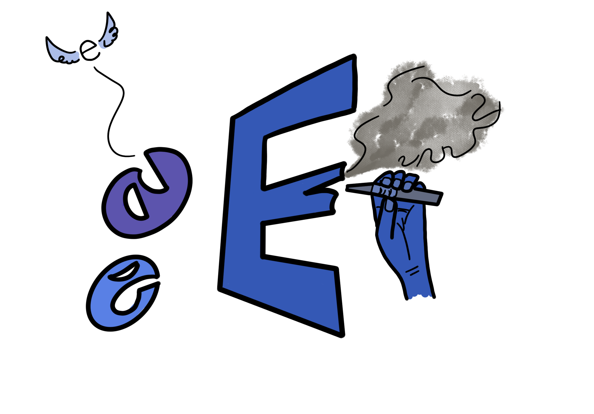

Een e-sigaret is een elektronisch apparaat waarmee het lijkt dat je rookt. In plaats van tabak kun je er damp mee roken. Tabak is gewoon gedroogde bladeren die je ook in een normale sigaret kan vinden.

<!--truncate-->

### Slecht
Met al die kleurtjes en smaakjes lijken vapes onschuldige speeltjes. Maar in de meeste vapes zit nicotine. Nicotine kan leiden tot hartkloppingen, duizeligheid, misselijkheid, hoge bloeddruk en zelfs epileptische aanvallen. Nicotine kan bij jonge kinderen de ontwikkeling van de hersenen verstoren. Hoe jonger een kind begint met het gebruik van nicotine, hoe sneller er een verslaving optreedt. Op basisschoolleeftijd zijn een paar trekjes al genoeg om een nicotineverslaving te ontwikkelen. Er zijn ook vapes zonder nicotine. Maar de damp van elke vape kan leiden tot irritatie en schade aan de longen. Er zitten ook stoffen in waarmee je kanker van kan krijgen.

### Jonge mensen
Waarom is vapen zo populair onder jongeren? Uit onderzoek blijkt dat vapen onder scholieren steeds vaker voorkomt. Op middelbare scholen maar ook zelf in groep 7. Ouders zitten met veel vragen: wat is vapen precies is? Hoe gevaarlijk is? Ze vragen zich af hoe ze hier het beste mee om kunnen gaan en op welke manier ze met hun kind hierover in gesprek kunnen gaan.

### Stoppen
Enzo Knol probeert al kinderen te laten stoppen met vapen. Het is slecht en ook gevaarlijk. Probeer thuis niet te vapen nu!

