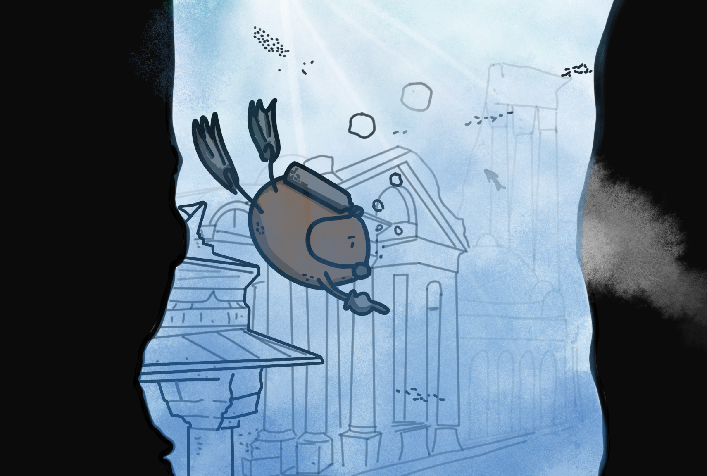

Atlantis zou een gezonken stad zijn voor de Spaanse kust, ten noorden van de stad Cádiz en in de buurt van het nationale park Doñana.

<!--truncate-->

### Bestaat Atlantis?
Het korte antwoord is: nee ik denk niet dat het echt bestaat want er zijn heel weinig plaatjes van Atlantis en sommige zien er nep uit of komen uit films. Atlantis is een Griekse mythe waarvan er mensen geloofden dat het verhaal echt is. Wil je weten wat de legende is? Lees dan het kopje hieronder. 

### De legende
Er zou een keer een stad zijn die heel mooi was maar niet echt erg stevig. De koning was rijk, mensen waren gelukkig maar de muren waren instabiel, dat betekent dat de muren niet stevig waren. Maar op een dag kwam er een enorme golf die zorgde ervoor dat er heel veel                  schade kwam. Daardoor stortte de stad in en kreeg de naam: Atlantis

### Conclusie
1. Atlantis bestaat NIET.
2. Atlantis is een legende (een mythe).
3. Er is geen bewijs.
4. En ik heb honger (maar dat heeft er niks mee te maken).

En nu een kleine mededeling, ik wil deze sites heel erg bedanken voor de vele informatie en goede uitleg. (dit betekent NIET dat ik informatie heb gestolen hoor, gewoon bedankt!)

### Referenties
- [Mass.cultureelerfgoed.nl](https://mass.cultureelerfgoed.nl/)
- [Isgeschiedenis.nl](https://isgeschiedenis.nl/)
